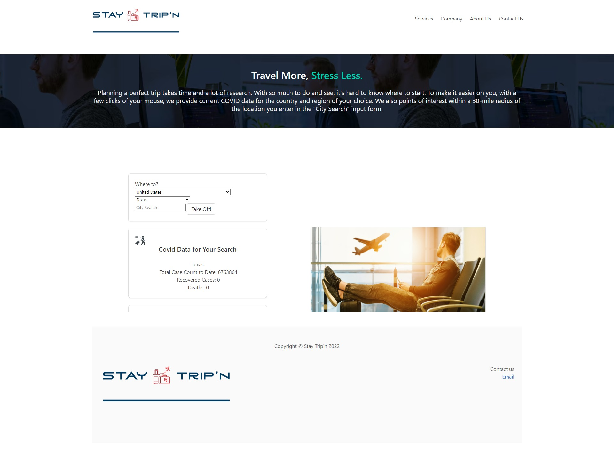

# STAY TRIPN'
### Group Project 1

## Table of Contents
1. [Project Description](#project-description)
2. [Deployed Website](#deployed-website)
3. [Built With](#built-with)
4. [Future Development](#future-development)
5. [Authors](#authors)

## Project Description
Planning a perfect trip takes time and a lot of research. With so much to do and see, it's hard to know where to start. To make it easier on you, with a few clicks of your mouse, we provide points of interest within a 30-mile radius of the location you enter in the "City Search" input form.
 
Although we all hoped 2022 would turn the corner on the pandemic, that just hasn't been the case. If you're planning a trip, we can provide access to COVID data for your particular destination. It includes data for cases and deaths.

### User Story
```
AS A traveler
I WANT to see the COVID stats and points of interest for my destination
SO THAT I can plan a trip accordingly.
```
### Acceptance Criteria
```
GIVEN a dashboard with dropdown selections
WHEN I search for a country
THEN I am presented with a list of regions.
WHEN I choose a region
THEN I am presented with current COVID-19 data for that region
WHEN I enter a city in the 'City Search' form
THEN I am presented with points of interest and weather information for that ciy
```

## Deployed Website
Deployed URL: https://mherring11.github.io/stay-tripn <br/><br/>


## Built With
* HTML
* CSS
* JavaScript
* [Bulma CSS Framework](https://bulma.io/)
* [COVID-19 Global Tracker API](https://rapidapi.com/popofibo/api/covid-19-global-tracker-with-regional-data/details)
* [OpenTripMap](https://opentripmap.io/product)
* [HTML Code Generator](https://www.html-code-generator.com/html/drop-down/country-names)

## Future Development
* We would like to add a way to get a targeted weather forecast for a date range when the user is planning on traveling to the location.
* We would like to make this a one-stop-shop for all travel infomation (ie. bus schedules, train & plane ticket info, tour info, attraction tickets, hotels, etc.).

## Authors
**Michael Herring**
- [GitHub Profile](https://github.com/mherring11)
- [LinkedIn](https://www.linkedin.com/in/michael-herring-aa602024/)

**David Barnes**
- [GitHub Profile](https://github.com/rohirrimsride)
- [LinkedIn](https://www.linkedin.com/in/dave-barnes-b017b945/)

**Samantha Guerra**
- [GitHub Profile](https://github.com/Sam-Antics)
- [LinkedIn](https://www.linkedin.com/in/seguerra/)
